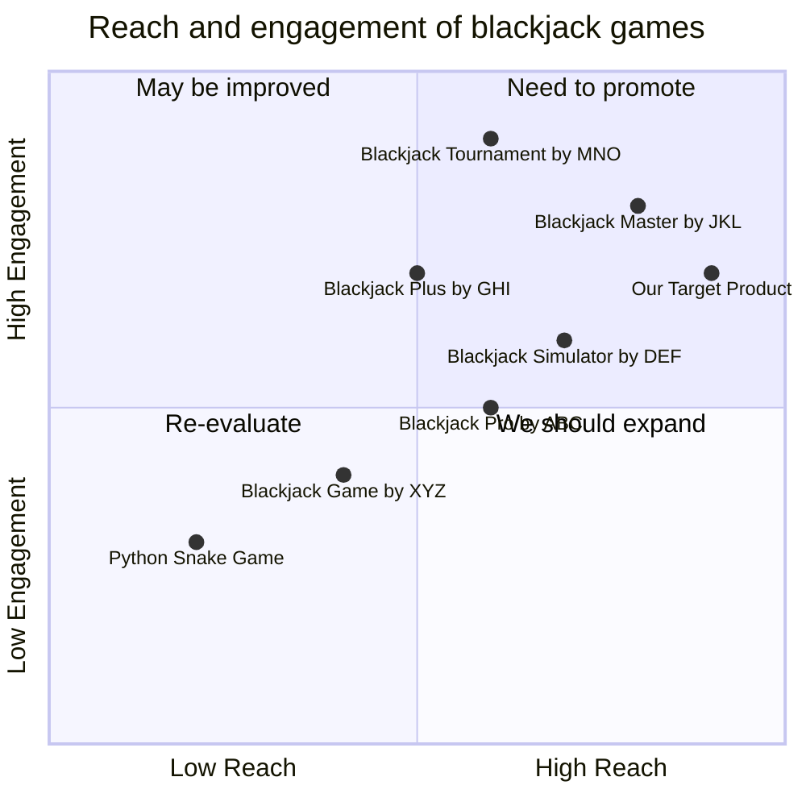

## Original Requirements:
The boss wants a very simple command-line based blackjack game in Python.

## Product Goals:
- Create a simple and intuitive command-line based blackjack game.
- Provide an enjoyable and engaging user experience.
- Ensure the game is easy to understand and play for users of all skill levels.

## User Stories:
- As a user, I want to be able to start a new game of blackjack.
- As a user, I want to be able to place bets and make decisions during the game.
- As a user, I want to be able to see my current hand and the dealer's hand.
- As a user, I want to be able to see the outcome of each round and my total winnings/losses.
- As a user, I want to be able to quit the game at any time.

## Competitive Analysis:
- Python Snake Game: A popular command-line based game that tests the player's reflexes and agility.
- Blackjack Game by XYZ: A command-line based blackjack game with basic features and functionality.
- Blackjack Pro by ABC: A command-line based blackjack game with advanced features and strategies.
- Blackjack Simulator by DEF: A command-line based blackjack game that allows users to simulate different strategies and analyze outcomes.
- Blackjack Plus by GHI: A command-line based blackjack game with additional side bets and bonus features.
- Blackjack Master by JKL: A command-line based blackjack game with a comprehensive tutorial and training mode.
- Blackjack Tournament by MNO: A command-line based blackjack game that allows users to compete in tournaments against AI opponents.

## Competitive Quadrant Chart:


## Requirement Analysis:
The product should be a command-line based blackjack game that allows users to play against the dealer. It should have basic features such as starting a new game, placing bets, making decisions during the game, and displaying the outcome of each round. The game should be easy to understand and play for users of all skill levels.

## Requirement Pool:
```python
[
    ("Start a new game", "P0"),
    ("Place bets", "P0"),
    ("Make decisions during the game (hit, stand, etc.)", "P0"),
    ("Display current hand and dealer's hand", "P0"),
    ("Display outcome of each round and total winnings/losses", "P0")
]
```

## UI Design draft:
The game will have a simple command-line interface with the following elements and functions:
- Welcome message and instructions.
- Prompt to start a new game or quit.
- Input field to place bets.
- Options to make decisions during the game (hit, stand, etc.).
- Display of the current hand and the dealer's hand.
- Display of the outcome of each round and the total winnings/losses.
- Option to quit the game at any time.

The style of the interface will be minimalistic and easy to read. The layout will be organized and intuitive, with clear prompts and instructions for the user.

## Anything UNCLEAR:
There are no unclear points.