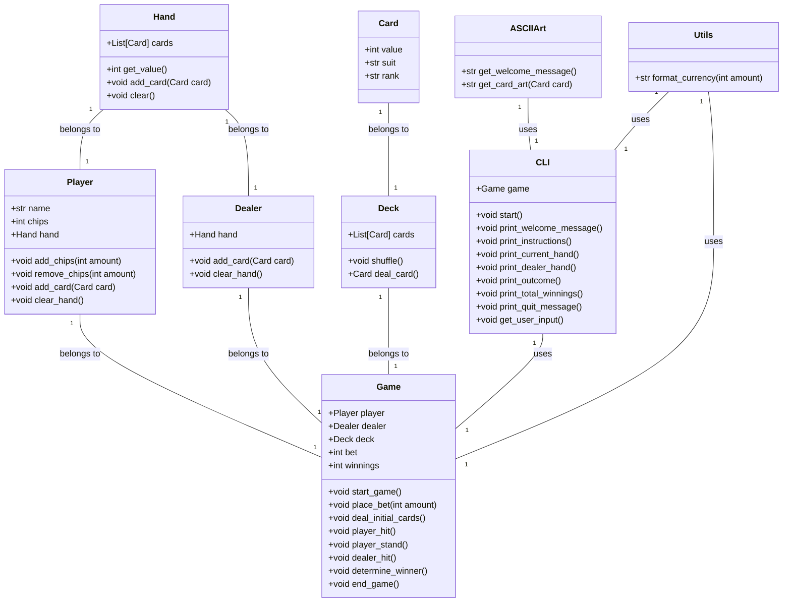
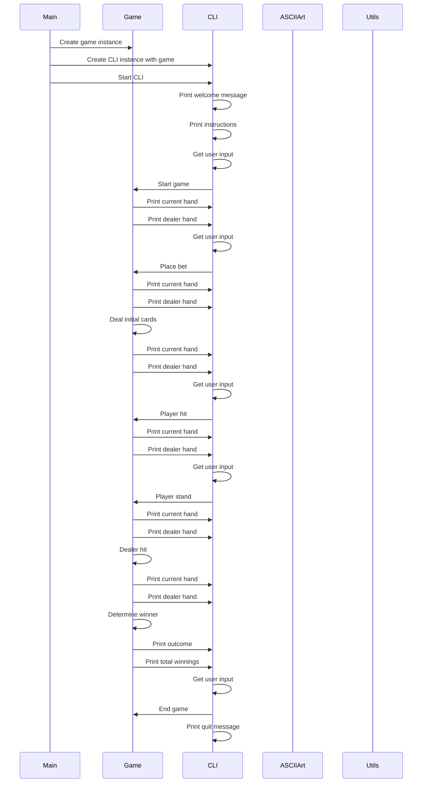

## Implementation approach:
For the implementation of the command-line based blackjack game, I will use the following open-source tools and frameworks:

1. Click: Click is a popular Python package for creating command-line interfaces. It provides a simple and intuitive way to define command-line commands and options. I will use Click to handle user input and create the command-line interface for the game.

2. Random: The random module in Python provides functions for generating random numbers. I will use the random module to shuffle the deck of cards and deal cards to the player and the dealer.

3. ASCII Art: I will use ASCII art libraries like art and pyfiglet to create visually appealing text-based graphics for the game, such as the welcome message and the display of cards.

4. Colorama: Colorama is a Python package that allows you to easily add ANSI escape sequences to your command-line output, enabling the use of colors and styles. I will use Colorama to add colors to the text-based graphics and enhance the visual experience of the game.

5. Tabulate: Tabulate is a Python package for creating ASCII tables from data. I will use Tabulate to display the current hand and the dealer's hand in a tabular format, making it easier for the user to read and understand.

## Python package name:
```python
"blackjack_game"
```

## File list:
```python
[
    "main.py",
    "deck.py",
    "player.py",
    "dealer.py",
    "game.py",
    "cli.py",
    "ascii_art.py",
    "utils.py"
]
```

## Data structures and interface definitions:


## Program call flow:


## Anything UNCLEAR:
The requirements are clear to me.