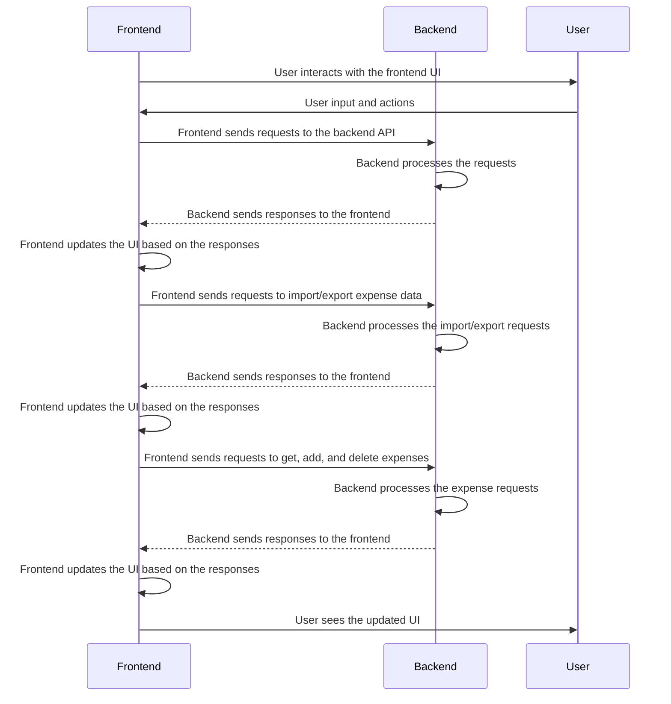

## Implementation approach:
For this expense tracking application, we will use the following open-source frameworks and tools:

1. React: We will build the frontend of the application using React, as it provides a robust and efficient way to create user interfaces.

2. Django: We will use Django, a high-level Python web framework, to handle the backend of the application. Django provides a clean and efficient way to handle data models, views, and templates.

3. Pandas: We will use the Pandas library to handle the import and export of expense data in CSV format. Pandas provides powerful data manipulation and analysis capabilities.

4. Matplotlib: For generating visualizations and insights based on the expense data, we will use the Matplotlib library. Matplotlib is a popular plotting library in Python and provides a wide range of visualization options.

5. Flask: We will use Flask, a lightweight web framework, to create a RESTful API for communication between the frontend and backend of the application.

## Python package name:
```python
"expense_tracker"
```

## File list:
```python
[
    "main.py",
    "models.py",
    "views.py",
    "serializers.py",
    "urls.py",
    "frontend/",
    "frontend/src/",
    "frontend/src/App.js",
    "frontend/src/Calendar.js",
    "frontend/src/Visualizations.js",
    "frontend/src/Insights.js",
    "frontend/src/ExpenseForm.js",
    "frontend/src/ExpenseList.js",
    "frontend/src/ExpenseItem.js",
    "frontend/src/ExportButton.js",
    "frontend/src/ImportButton.js",
    "frontend/src/styles.css",
    "frontend/public/index.html",
    "frontend/public/favicon.ico",
    "frontend/public/manifest.json",
    "frontend/public/logo192.png",
    "frontend/public/logo512.png",
    "frontend/public/robots.txt",
    "frontend/public/asset-manifest.json",
    "frontend/public/precache-manifest.js",
    "frontend/public/service-worker.js",
    "frontend/public/static/css/main.5f361e03.chunk.css",
    "frontend/public/static/js/2.7b2c7e3f.chunk.js",
    "frontend/public/static/js/main.8e7d9e0e.chunk.js",
    "frontend/public/static/js/runtime-main.4f8a2b6f.js"
]
```

## Data structures and interface definitions:
```mermaid
classDiagram
    class Expense{
        +int id
        +float amount
        +str category
        +str description
        +date date
        +str account
    }
    class ExpenseSerializer{
        +int id
        +float amount
        +str category
        +str description
        +date date
        +str account
    }
    class ExpenseList{
        +List[Expense] expenses
        +add_expense(expense: Expense): None
        +delete_expense(expense_id: int): None
        +get_expenses(): List[Expense]
    }
    class ExpenseForm{
        +float amount
        +str category
        +str description
        +date date
        +str account
        +submit_form(): None
    }
    class Calendar{
        +List[Expense] expenses
        +click_day(date: date): None
    }
    class Visualizations{
        +List[Expense] expenses
        +generate_visualizations(): None
    }
    class Insights{
        +List[Expense] expenses
        +generate_insights(): None
    }
    class ExportButton{
        +List[Expense] expenses
        +export_expenses(): None
    }
    class ImportButton{
        +List[Expense] expenses
        +import_expenses(file_path: str): None
    }
    class ExpenseAPI{
        +get_expenses(): List[Expense]
        +create_expense(expense: Expense): Expense
        +delete_expense(expense_id: int): None
    }
    class ExpenseViewSet{
        +get_queryset(): List[Expense]
        +create(request): Expense
        +destroy(request, pk: int): None
    }
    class urls{
        +urlpatterns: List[str]
    }
    ExpenseList "1" -- "1" Expense: has
    ExpenseForm "1" -- "1" Expense: has
    Calendar "1" -- "1" Expense: has
    Visualizations "1" -- "1" Expense: has
    Insights "1" -- "1" Expense: has
    ExportButton "1" -- "1" Expense: has
    ImportButton "1" -- "1" Expense: has
    ExpenseAPI "1" -- "1" ExpenseViewSet: has
    urls "1" -- "1" ExpenseAPI: has
]
```

## Program call flow:


## Anything UNCLEAR:
The requirements are clear to me.