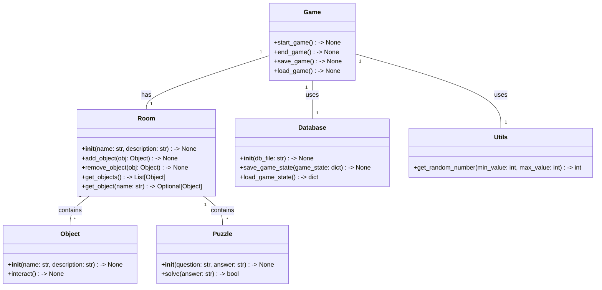
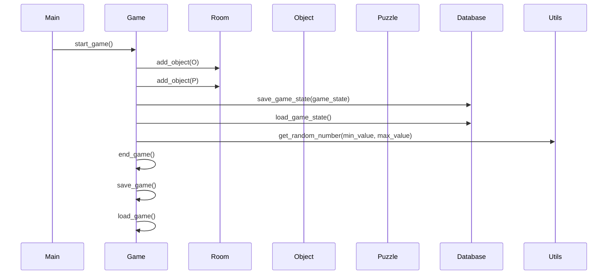

## Implementation approach:
For the implementation of the text adventure game, we will use the following open-source tools and frameworks:

1. Python: We will implement the game using Python, as specified in the requirements.

2. Click: Click is a popular open-source package for creating command-line interfaces in Python. We will use Click to create the CLI-based interface for our game.

3. Pygame: Pygame is a set of Python modules for creating games and multimedia applications. We will use Pygame to handle the graphics and audio aspects of our text adventure game.

4. SQLite: SQLite is a lightweight, serverless database engine that is widely used in Python applications. We will use SQLite to store and retrieve game data, such as player progress and room information.

5. Random: The random module in Python provides functions for generating random numbers. We will use the random module to add randomness to our game, such as randomizing room layouts and puzzle solutions.

## Python package name:
```python
"text_adventure_game"
```

## File list:
```python
[
    "main.py",
    "game.py",
    "room.py",
    "object.py",
    "puzzle.py",
    "database.py",
    "utils.py"
]
```

## Data structures and interface definitions:


## Program call flow:


## Anything UNCLEAR:
The requirements are clear to me.